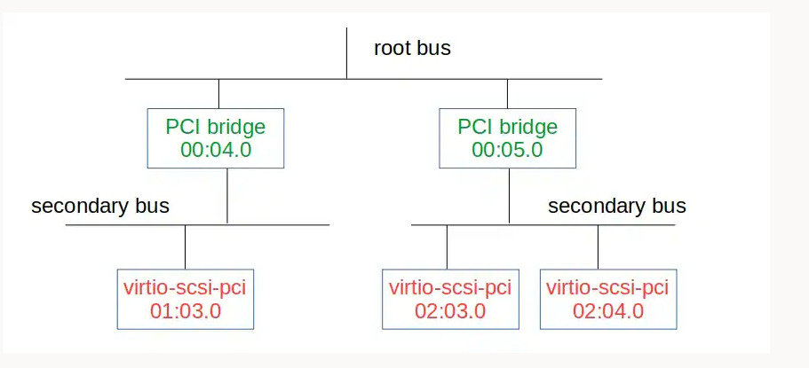
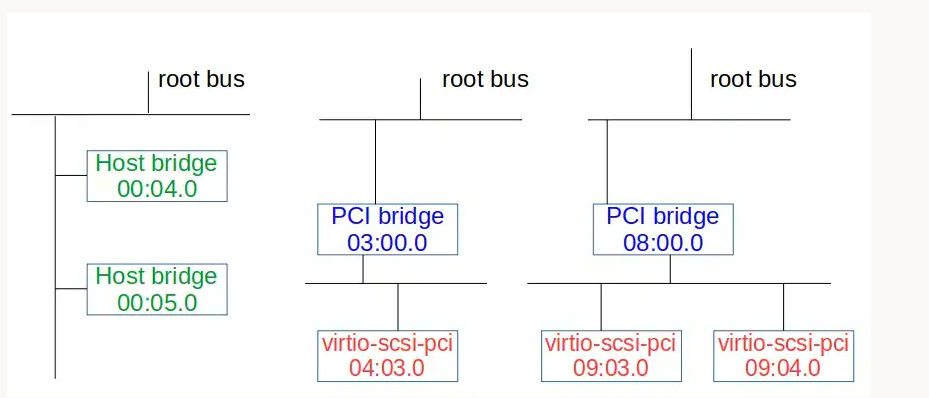
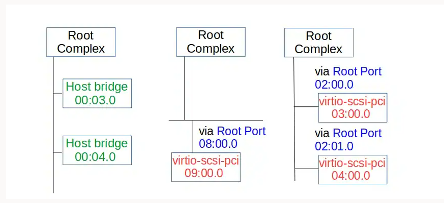
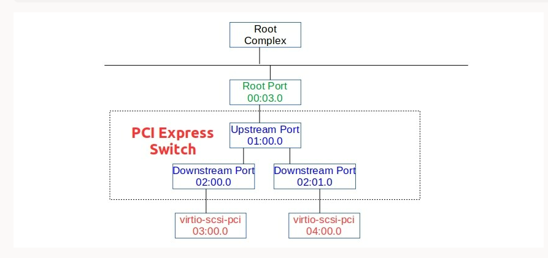
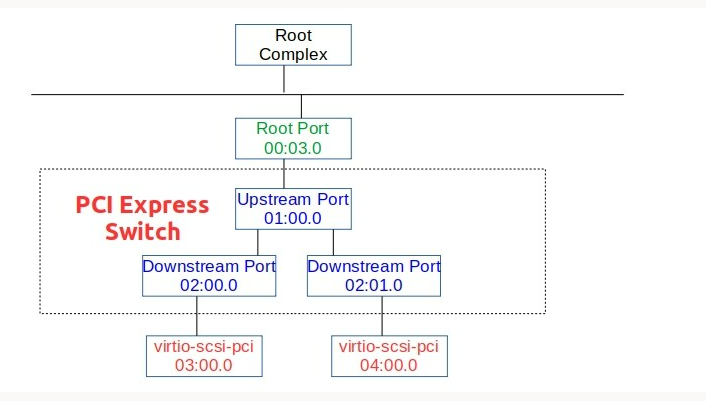

# pcie 设备类型

```
    ----------------------------------------------------------------------------
        |                |                    |                  |
   -----------   ------------------   -------------------   --------------
   | PCI Dev |   | PCIe Root Port |   | PCIe-PCI Bridge |   |  pxb-pcie  |
   -----------   ------------------   -------------------   --------------
    (1) PCI Devices (e.g. network card, graphics card, IDE controller),
        not controllers. Place only legacy PCI devices on
        the Root Complex. These will be considered Integrated Endpoints.
        Note: Integrated Endpoints are not hot-pluggable.

        Although the PCI Express spec does not forbid PCI Express devices as
        Integrated Endpoints, existing hardware mostly integrates legacy PCI
        devices with the Root Complex. Guest OSes are suspected to behave
        strangely when PCI Express devices are integrated
        with the Root Complex.

    (2) PCI Express Root Ports (pcie-root-port), for starting exclusively
        PCI Express hierarchies.

    (3) PCI Express to PCI Bridge (pcie-pci-bridge), for starting legacy PCI
        hierarchies.

    (4) Extra Root Complexes (pxb-pcie), if multiple PCI Express Root Buses
        are needed.
```

# PCIE 规格

Each PCI domain：256 buses

A PCI Express Root bus: 32 devices.

A single PCI Express to PCI Bridge: 32 slots

each PCI Express Root Port : 8 functions












# pcie 拓扑

# pcie 枚举
